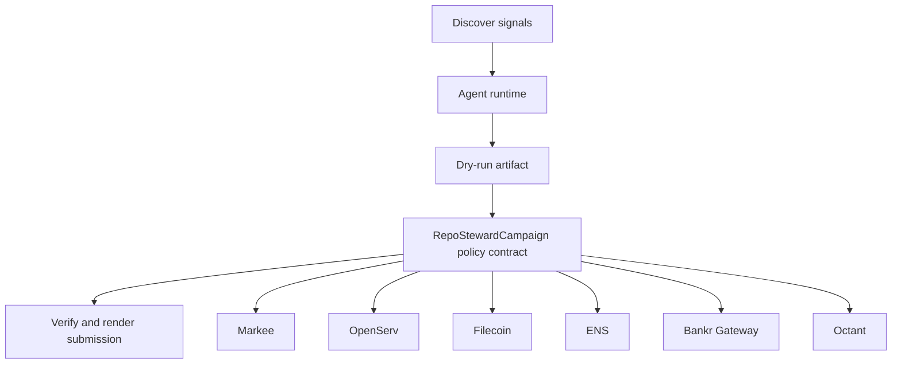

# Repo Steward Agent

- **Repo:** `Synthesis-Markee`
- **Primary track:** Markee
- **Category:** autonomy
- **Submission status:** implementation ready, waiting for credentials and TxIDs.

A repo-stewarding agent that drafts updates, messages, and build-story artifacts for public codebases while maintaining a verifiable audit trail.

## Selected concept

A repo-stewarding agent drafts updates, messages, and build-story artifacts for public codebases while maintaining a verifiable audit trail. The contract side stores campaign receipts and payout policy state while Python tooling assembles GitHub-ready deliverables.

## Idea shortlist

1. Autonomous OSS Improvement Messenger
2. Onchain Build Story Distributor
3. Revenue-Aware GitHub Growth Loop

## Partners covered

Markee, OpenServ, Filecoin, ENS, Bankr Gateway, Octant, Ampersend

## Architecture



## Repository layout

- `src/`: shared policy contracts plus the repo-specific wrapper contract.
- `script/`: Foundry deployment entrypoint.
- `agents/`: Python runtime, partner adapters, and project metadata.
- `scripts/`: CLI utilities for running the loop and rendering submissions.
- `docs/`: architecture, credentials, demo script, and security notes.
- `submissions/`: generated `synthesis.md` snippet for this repo.

## Action catalog

| Action | Partner | Purpose | Max USD | Sensitivity |
| --- | --- | --- | --- | --- |
| `markee_repo_message` | Markee | Use Markee for a bounded action in this repo. | $5 | low |
| `openserv_job_dispatch` | OpenServ | Use OpenServ for a bounded action in this repo. | $10 | medium |
| `filecoin_proof_store` | Filecoin | Use Filecoin for a bounded action in this repo. | $20 | medium |
| `ens_ens_publish` | ENS | Use ENS for a bounded action in this repo. | $5 | low |
| `bankr_gateway_compute_route` | Bankr Gateway | Use Bankr Gateway for a bounded action in this repo. | $10 | high |
| `octant_signal_publish` | Octant | Use Octant for a bounded action in this repo. | $25 | medium |
| `ampersend_settlement_bundle` | Ampersend | Use Ampersend for a bounded action in this repo. | $25 | medium |

## Commands

```bash
python3 -m unittest discover -s tests
forge test
python3 scripts/run_agent.py
python3 scripts/plan_live_demo.py
python3 scripts/render_submission.py
```

## Credentials

| Partner | Variables | Docs |
| --- | --- | --- |
| Markee | MARKEE_API_KEY, MARKEE_MESSAGE_URL | https://markee.xyz/ |
| OpenServ | OPENSERV_API_KEY, OPENSERV_AGENT_URL | https://docs.openserv.ai/ |
| Filecoin | FILECOIN_API_TOKEN, FILECOIN_UPLOAD_URL | https://docs.filecoin.cloud/ |
| ENS | ENS_NAME | https://docs.ens.domains/ |
| Bankr Gateway | BANKR_API_KEY, BANKR_CHAT_COMPLETIONS_URL, BANKR_MODEL | https://bankr.bot/ |
| Octant | OCTANT_SIGNAL_URL | https://octant.app/ |
| Ampersend | AMPERSEND_API_KEY, AMPERSEND_PAYMENT_URL | https://docs.ampersend.ai/ |

## Live demo plan

1. Copy .env.example to .env and fill the required keys.
2. Deploy the contract with forge script script/Deploy.s.sol --broadcast for RepoStewardCampaign.
3. Run python3 scripts/run_agent.py to produce a dry run for repo_steward.
4. Set LIVE_MODE=true and rerun python3 scripts/run_agent.py with real credentials.
5. Run python3 scripts/render_submission.py and attach TxIDs plus repo links.
